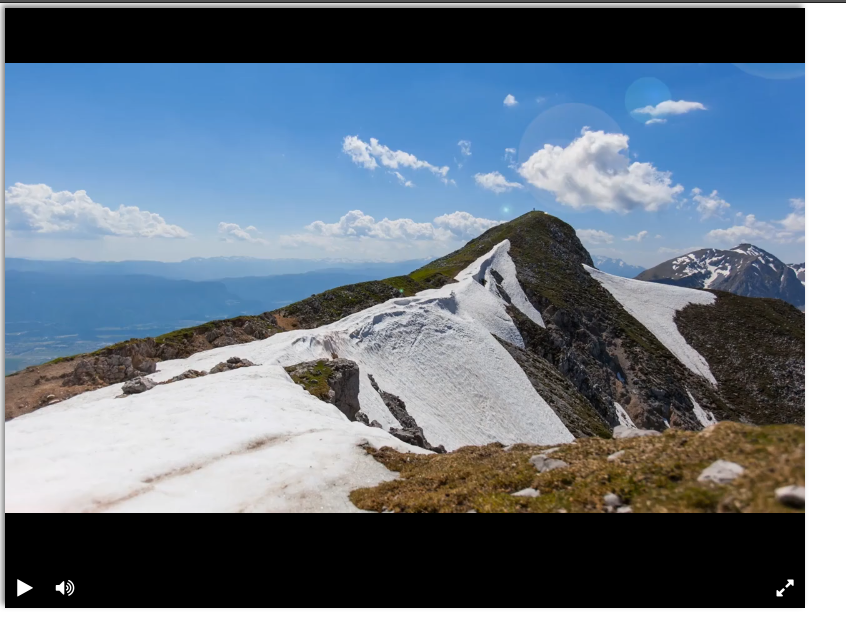

# Проект Видеоплейр

Текущий проект ялется веб-страницей и может использоваться как HTML/CSS/JS шаблоном видеоплейра

Для запуска проекта необходимо:
* браузер (поддерживающий HTLM5)

Что бы открыть и посмотреть веб-страницу, откройте `index.html` в браузере 

## Описание 
* Основные стили и разметки веб-страницы описаны в  `index.html`
* в папке  `./css/`  хранятся файлы с внешними стилями
* в папке  `./js/` хранятся программные коды написанные на языке программирования  javascript , отвечающие за интерактивность web-страницы
* в файле  `./js/player.js`  реализованы функционал видеоплейера (действие кнопок, запуск видео и т.п.)
* в папке  `./favicon/`  Хранится иконка веб-страницы
* в папке  `./fonts/`  Хранятся шрифты для отображения иконок (кнопок)
* в файле  `./css/font-awesome.min.css`  описаны стили для иконок (кнопок)